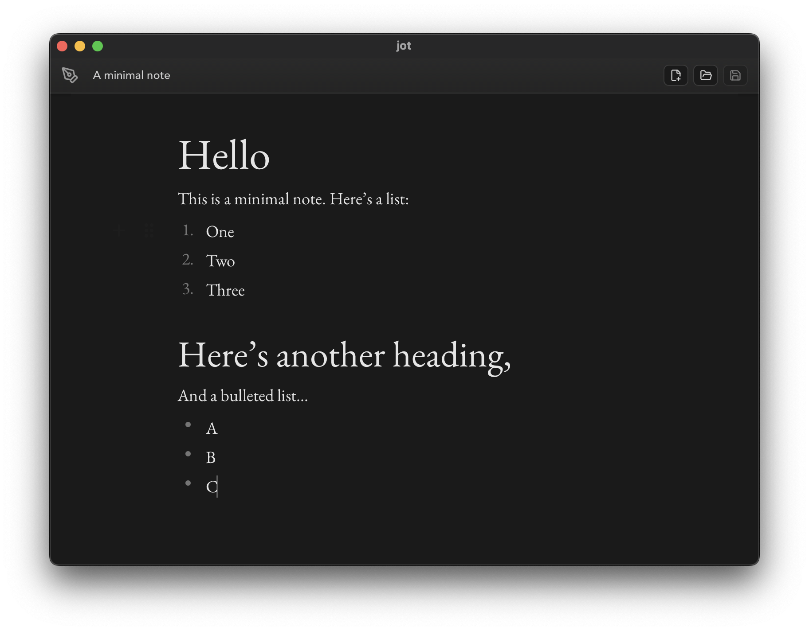

<div align="center">

# jot

**A minimalist markdown editor for macOS, Windows, and Linux**



Clean, distraction-free writing with live markdown rendering

[](https://github.com/benshanahan1/jot/releases)
[](https://github.com/benshanahan1/jot/actions)

[Download](https://github.com/benshanahan1/jot/releases) · [Report Bug](https://github.com/benshanahan1/jot/issues) · [Request Feature](https://github.com/benshanahan1/jot/issues)

</div>

---

## Features

- Minimalist design focused on writing
- Live markdown rendering
- Cross-platform (macOS, Windows, Linux)
- Multiple fonts and themes
- Text scaling and zoom controls
- Fast and lightweight

## Installation

Download the latest release for your platform:

- **macOS**: Download the `.dmg` file
- **Linux**: Download the `.deb` or `.AppImage` file
- **Windows**: Download the `.msi` installer

[**→ Get the latest release**](https://github.com/benshanahan1/jot/releases/latest)

## Development

### Prerequisites

- [Node.js](https://nodejs.org/) (v20 or later)
- [Rust](https://rustup.rs/)
- [Bun](https://bun.sh/) (optional, for faster builds)

### Setup

```bash
# Clone the repository
git clone https://github.com/benshanahan1/jot.git
cd jot

# Install dependencies
npm install

# Run in development mode
npm run tauri dev

# Build for production
npm run tauri build
```

### Tech Stack

- **Frontend**: React, TypeScript, Vite
- **Backend**: Tauri (Rust)
- **Editor**: Milkdown (Markdown rendering)
- **Testing**: Vitest

## Keyboard Shortcuts

| Action | macOS | Windows/Linux |
|--------|-------|---------------|
| New File | `Cmd+N` | `Ctrl+N` |
| Open File | `Cmd+O` | `Ctrl+O` |
| Save | `Cmd+S` | `Ctrl+S` |
| Save As | `Cmd+Shift+S` | `Ctrl+Shift+S` |
| Zoom In | `Cmd+=` | `Ctrl+=` |
| Zoom Out | `Cmd+-` | `Ctrl+-` |
| Reset Zoom | `Cmd+0` | `Ctrl+0` |

## Command Line

Open a file directly from your terminal:

```bash
jot file.md
```

On macOS, `jot` is also a built-in system command (`/usr/bin/jot`), so install the wrapper below to make this app's `jot` command take priority.

Install a local CLI wrapper:

```bash
./scripts/install-cli.sh
```

This also adds a zsh completion override (`compdef _files jot`) so `jot <TAB>` completes filenames instead of system `jot` options.

Then verify:

```bash
which -a jot
source ~/.zshrc
compdef | grep -E '^jot='
jot README.md
```

## Acknowledgments

- Built with [Tauri](https://tauri.app/)
- Markdown editing powered by [Milkdown](https://milkdown.dev/)
